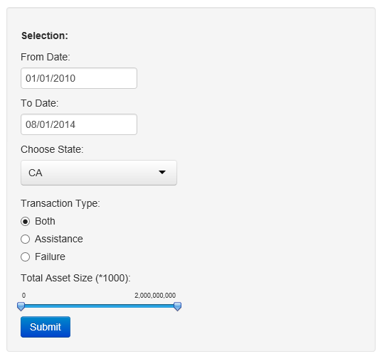

Bank Failures & Assistance Transactions In the US From 1970 - 2014
========================================================
author: Adi J
date: 08/23/2014

About
========================================================
The Federal Deposit Insurance Corporation (FDIC) is a United States government corporation operating as an independent agency. 

Since the start of FDIC insurance on January 1, 1934, no depositor has lost any insured funds as a result of a failure. 

The FDIC has a **'Historical Statistics on Banking'** which tracks the Failures & Assistance Transactions carried out by the FDIC since its inception.

This Analysis provides a **visual representation of bank failures and assistance transactions** carried out by the FDIC in the US since 1970.

Selecting The Data
========================================================
The application has a database in csv format in the backend. For every request, the data is read and filtered on the criteria selected. 



 
Plotting The Data - 1
========================================================
From the ui.R


```r
library(ggplot2)
df <- read.csv(text=input_data)
df$EffectiveDate <- as.Date(as.character(df$EffectiveDate), "%m/%d/%Y")
df$year <- format(df$EffectiveDate, "%Y")
plotdata <- aggregate(InstitutionName~year+CharterClass, data=df, FUN=length)
```


```r
ggplot(plotdata, aes(year, weight = InstitutionName)) + geom_bar(aes(fill=CharterClass)) + ggtitle("Bank Failure/Assistance Transactions In the US per Year") + ylab("Number of Failures/Assistance Transactions") + xlab("Year")
```

Plotting The Data - 2
========================================================
Plot Result (Generated by R Code in the file): 

 

Data Table - 1
========================================================
Data Table (Generated by R Code in the file): 


```r
summary(df)
```

```
                             Institution Name          City    State  
 1ST PACIFIC BANK OF CALIFORNIA      : 1      CHICO      : 1   CA:17  
 BUTTE COMMUNITY BANK                : 1      GRANITE BAY: 1          
 CANYON NATIONAL BANK                : 1      LA JOLLA   : 1          
 CHARTER OAK BANK                    : 1      LOS ANGELES: 1          
 CITIZENS BANK OF NORTHERN CALIFORNIA: 1      NAPA       : 1          
 FIRST REGIONAL BANK                 : 1      NEVADA CITY: 1          
 (Other)                             :11      (Other)    :11          
 Effective Date       Charter Class Failure/Assistance
 Min.   :2010-01-29   N  :3         FAILURE:17        
 1st Qu.:2010-05-07   NM :9                           
 Median :2010-08-20   SA :1                           
 Mean   :2010-10-10   SB :2                           
 3rd Qu.:2011-02-11   SM :2                           
 Max.   :2012-04-27                                   
                                                      
 Total Deposits (* $1000) Total Assets (* $1000)
 1,664,450: 1             Min.   :  48000       
 101,127  : 1             1st Qu.: 129253       
 105,309  : 1             Median : 312077       
 129,023  : 1             Mean   : 605243       
 2,799,362: 1             3rd Qu.: 498751       
 205,285  : 1             Max.   :3646071       
 (Other)  :11                                   
```


Conclusion & Links
========================================================
Shiny & R Presentation make presenting and distributing data analyses fast and convenient.

1. The Shiny project is hosted [here](http://ajammala.shinyapps.io/BuildingDataProducts/ "Shinyapps").

2. The github repository can be found [here](https://github.com/ajammala/BuildingDataProducts "GithubLink")


